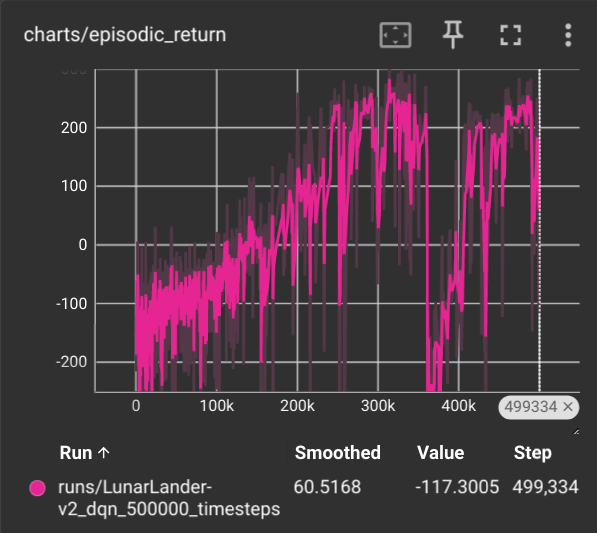
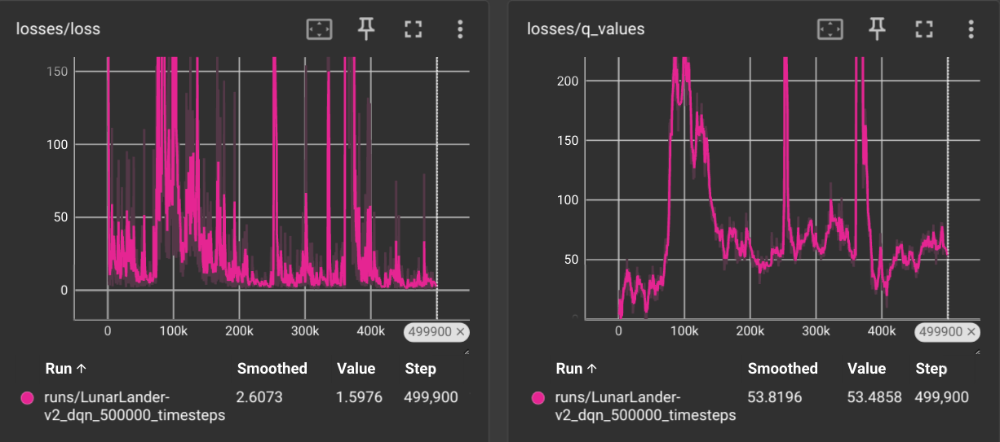

# Reinforcement Learning with PyTorch and Gymnasium

We implemented Deep Q Network (DQN) and Proximal Policy Optimization (PPO) algorithms from scratch using PyTorch. The agents were trained and tested in the Gymnasium environments "Lunar Landing V2" and "Cartpole".

## Quick start

```sh
pip install -r requirements.txt
python3 lunar_lander_dqn.py
```

Check the common issues section if you have problems with `box2d`.

## Repository structure

The repo is structured as follows:

- `algorithms`: contains implementation for the DQN and PPO algorithms.
- `docs`: graphics used for documentation.
- `models`: saved model weights.
- `lunar_lander_random.py`: random agent in the Lunar Lander environment.
- `lunar_lander_dqn.py`: train and test agent in the Lunar Lander environment using the DQN algorithm.
- `lunar_lander_dqn_td.py`: a modified version of the DQN algorithm more resilient against catastrophic memory loss and forgetfulness.
- `cartpole_ppo.py`: train and test agent in the Cartpole environment using the PPO algorithm.

## About terminology

Common terminology used in Reinforcement Learning (and in this README) includes:

- policy: a function that maps states to actions;

## About Deep Q Network (DQN)

A Deep Q Network (DQN) approximates the optimal action-value function (Q-function) using deep neural networks. It is designed to enable agents to learn how to behave optimally in environments with large, high-dimensional state spaces, where traditional Q-learning would be computationally infeasible.

In the Lunar Lander environment, we notice catastrophic forgetting during training around the 360k step. It's episodic return (reward) and losses can be seen in the following graphs:





We can mitigate this undesired effect by implementing a modification from recent research: a target network that our base DQN will mirror.

## About Proximal Policy Optimization (PPO)

Proximal Policy Optimization (PPO) is a popular reinforcement learning algorithm that is used to train agents using policy gradient methods, which optimize a policy directly by adjusting its parameters to maximize the expected reward. Its relatively stable, efficient, and easy to implement. Some key features include:

- **clipping**: PPO introduces a clipping mechanism to prevent large, potentially destructive updates to the policy. The idea is to limit the change in the policy between updates to ensure stable learning. The objective function is clipped within a range, which helps to keep the updates conservative.
- **surrogate objective**: PPO uses a surrogate objective function that estimates the expected reward while considering the ratio of the new policy to the old policy. This objective is adjusted with the clipping, balancing exploration and exploitation without deviating too much from the current policy.

## Acknowledgements

These short projects were developed during the UEF Summer School "AI Agents for Video Games" lectured by Prof. Ville Hautamäki and Federico Malato.
